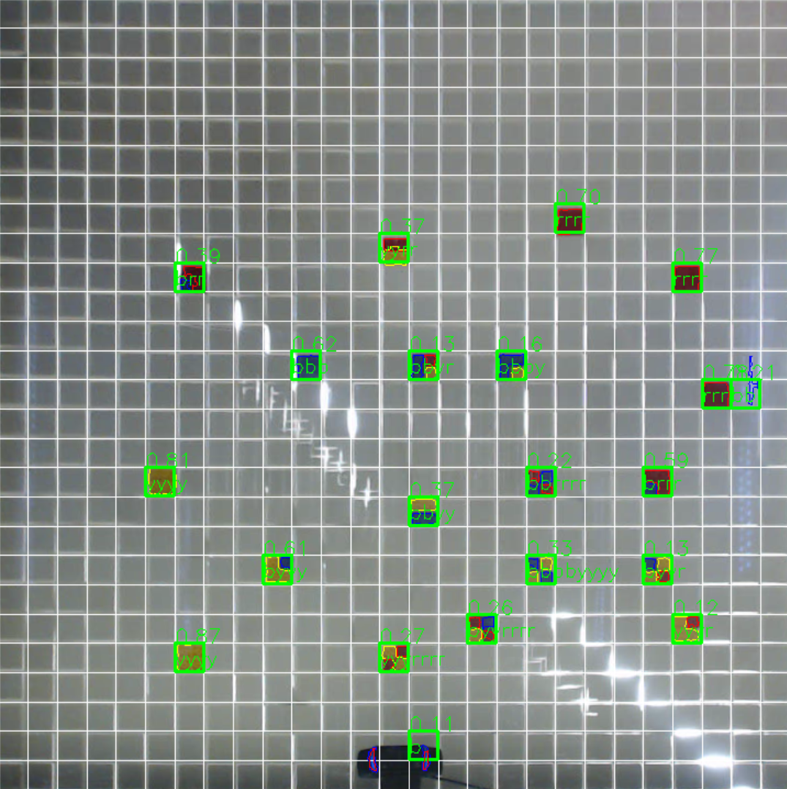

# CityScope Detector

## What is it good for?

This is a tool for capturing, key-stoning, scanning and sending uniquely tagged arrays of 2-dimension physical colored bricks. CityScope Scanner will detect colors in arrays of 2d-pixel arrays at configurable sizes. Then, these color arrays will be decoded...
- [keystones](./scanner/keystone.py)
- [detection](./scanner/modules.py)
- [multicam- grid merge](./scanner/gridmerger.py)
- [detect changes](./processing/detect_changes.py)
- [publish results](./processing/publisher.py) (e.g. autobahn -> CSL compatible)

## Running Regularly / Quick-Run

When using this for the first time with a new setup, it is advised to set the keystones first (see below).
For detecting colour-coded squares in video feeds, run
`$ python3 -m scanner.scanner`
after previously setting keystones. The results will be separate matrices for every camera/video filled with codes. It will also start a subprocess to merge the result matrices to a single one locally, which is published via UDP.

Running `$ python3 -m scanner.scanner -D` shows the live camera feed(s), detections and allows to fine-tune the keystones

The merged grid can be processed by
`$ python3 -m processing.publisher`
to detect changes (after some temporal smoothing) and publish these via WAMP to an autobahn service.

## Setup and Calibration

### requirements
* python 3
* numpy
* opencv
* imutils (can be reimplemented easily)

  (WAMP publishing only)

* twisted
* autobahn

- get python 3.4 and above, clone this repo
- Install packages manually or using `pip` via `pip install -r requirements.txt`

## Config file

The [config file](./data/config.json) contains all the network identifiers and grid specification. Specifically:
* number of cameras: 2 will be merged horizontally, 4 in a square
* camera sources: put a cv2.VideCapture compliant URI or "local" to detect USB cams (not implemented for more than 1 camera atm)
* gridsize: these are to be understood _per camera_
* rotate_*: Number of anticlockwise rotations of the respective camera. Negative numbers are clockwise rotations.
* overlap: when two cameras have 1 or more common rows/rolumns of cells, set this here, will be subtracted while merging. A negative number means the cameras don't capture the whole grid, so it will be padded with zero-filled rows/columns
* coding_resolution: this defines, how many uniquely coloured subdivisions a single grid cell can have. Only tested for 2x2
* UDP: address nad port to send the grid between gridmerger.py and publisher.py
* ws_server: where to publish and subscribe to WAMP
* ws_topic: topic on the server the resulting detected changes get sent to

### Keystones

- Run `keystone` with: `$ python3 keystone.py` or `$ python3 -m scanner.scanner -K`
- `$ python3 keystone -c C` runs the keystone utility for the _C_th camera (by order of config.json)


- the tool will start, assuming a webcam is connected and working
- Select 4 corners [upper left, upper right, bottom left, bottom right, at this order] of keystone region
  Note: no need to exactly select the corners, as these are only initial guides for `scanner` tool
- `keystone.py` will create `keystone.txt` and close


- Run `scanner` with `$ python3 -m scanner.scanner -D`. Tool will start scanning using the key stone data created with `keystone.py`.
- make corrections to the key stone using the sliders. Press `s` to save changes to file and `q` to close the program.


## Scan results:

... todo: describe format, permutation codes



FindingPlaces compatible colour coding:
```
COLOUR_CODES = {
    "bbbb" : 240,
    "bbby" : 280,
    "bbyy" : 320,
    "byyy" : 400,
    "rrrr" : 40,
    "brrr" : 80,
    "bbrr" : 120,
    "bbbr" : 200,
    "yyyy" : -1,
    "rryy" : 1500
}
```

## Optional

- Use `helpers/udp_listener.py` to emulate UDP server listener and test received string

### Camera Calibration

`$ python3 calibrate.py` allows to determine the camera matrix and distortion coefficients for each camera by use of a printed out [checkerboard pattern](./calib-checkerboard.png). Use this, when you are having trouble with barrel distortion etc and the detection doesn't work well.
1. Hold pattern in front of camera
2. Press `c` key to sample an image
3. Do this a couple of times. Make sure to hold the pattern in the edges of the view as well
4. Press `m` key to calculate the camera matrix and save it to disk
5. If `num_cams` in the config file is set, this will repeat for each camera. You can skip cameras by pressing the  `q` key.